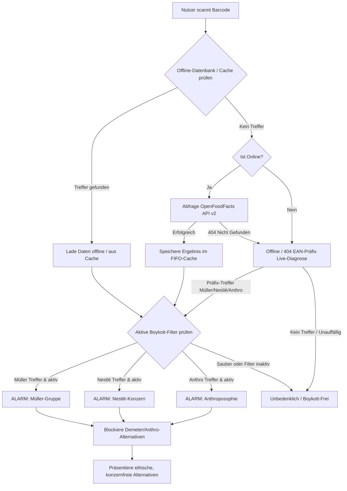

# 📱 Paranoid Android Boykott App — Der ultimative mobile Konsum-Filter

**Paranoid Android Boykott App** ist eine hochperformante, native Android-Hybrid-App (Vite + TS + Capacitor) im edlen Glassmorphic-Dark-Mode. Sie ermöglicht es Verbrauchern im Supermarkt direkt am Regal, Lebensmittel und Drogerieartikel sekundenschnell über die Smartphone-Kamera zu scannen und fundierte Kaufentscheidungen zu treffen.

Die Anwendung deckt drei große Boykott-Dimensionen ab: die **Unternehmensgruppe Theo Müller (UTM)**, den **Nestlé-Konzern** sowie **Anthroposophie- & Demeter-Verflechtungen** (darunter dm-drogerie markt, Weleda, Alnatura und Dr. Hauschka). Über interaktive Schalter lässt sich das Kontrollprofil in Echtzeit anpassen.

👉 **GitHub Repository:** [https://github.com/kolkrabeofdoom/paranoid-android-boykott-app](https://github.com/kolkrabeofdoom/paranoid-android-boykott-app)

---

## 🧐 Warum boykottieren? (Die drei Dimensionen)

Die Kritik an den jeweiligen Akteuren basiert auf weitreichenden politischen, gesellschaftlichen und ökologischen Missständen:

### 1. 🥛 Unternehmensgruppe Theo Müller (UTM)
* **Rechtsextreme Kontroversen:** Theo Müller pflegt nach eigenen Angaben regelmäßigen Kontakt zur AfD-Spitzenpolitik (Alice Weidel) und verweigert die klare Abgrenzung von rechtsextremen Positionen.
* **Subventions-Abgreifung:** Schließung regionaler Traditions-Molkereien bei gleichzeitigem Bezug von Millionen an deutschen Steuergeldern für sächsische Megawerke (z. B. Leppersdorf).
* **Steuerflucht:** Umzug des Firmengründers in die Schweiz (Erlenbach ZH), um der deutschen Erbschaftsteuer zu entgehen.
* **Monopolismus:** Aggressive Preisunterbietung gefährdet die Existenz familiengeführter Landwirtschaften.

### 2. 🐦 Nestlé-Konzern
* **Wasserprivatisierung:** Abpumpen von Grundwasser in dürregefährdeten Regionen und Schwellenländern, um es als Premium-Flaschenwasser (Vittel, Perrier, San Pellegrino) teuer zu vermarkten.
* **Menschenrechtsverletzungen:** Systematisch ungelöste Probleme mit Kinderarbeit, Schuldknechtschaft und Ausbeutung in den westafrikanischen Kakao-Lieferketten (z. B. KitKat, Smarties).
* **Babymilch-Skandal:** Historisch und gegenwärtig aggressive Vermarktungspraktiken von Säuglingsmilchpulver in Entwicklungsländern ohne sauberen Wasserzugang.

### 🔮 3. Anthroposophie & Demeter
* **Esoterik & Pseudowissenschaft:** Die biodynamische Landwirtschaft (Demeter) und anthroposophische Medizin (Weleda, WALA/Dr. Hauschka) basieren auf den Lehren von Rudolf Steiner. Diese verlangen unwissenschaftliche Praktiken (z. B. das Eingraben von Mist in Kuhhörnern nach Sternenkonstellationen) und entbehren oft empirischer Nachweise.
* **Problematisches Weltbild:** Rudolf Steiners Schriften beinhalten rassistische, antisemitische und deterministische Thesen über die Reinkarnationsstufen menschlicher Seelen.
* **Intransparente Geldflüsse:** Riesenumsätze von Alnatura oder Weleda fließen über Stiftungsnetzwerke verdeckt in die Alimentierung esoterischer Waldorf- und anthroposophischer Einrichtungen.
* **Konzern-Verwebung:** dm-Gründer Götz Werner konzipierte dm-drogerie markt explizit nach Steiners "sozialer Dreigliederung" und verankerte anthroposophische Führungsprinzipien dauerhaft im Management.

---

## ✨ Features der Android-App

### 📸 1. Mobiler Live-Kamera-Scanner
Dank der nativen Android-Kameraintegration und der `html5-qrcode` Bibliothek können Sie Barcodes direkt im Supermarkt erfassen. Die App fordert beim ersten Start die Kamera-Berechtigung an und nutzt die Autofokus-Linse Ihres Smartphones für blitzschnelles Scannen.

### 🎯 2. Kristallklares Mipmap App-Icon
Das App-Icon wurde für alle gängigen Bildschirmdichten (mdpi, hdpi, xhdpi, xxhdpi, xxxhdpi) verlustfrei skaliert. Dies garantiert eine messerscharfe, pixelgenaue Darstellung auf dem Startbildschirm und im App-Drawer moderner Smartphones (ohne Unschärfen oder Aliasing).

### 🛡️ 3. Dynamisches Drei-Filter-System
Nutzer können Müller-Gruppe, Nestlé und Anthroposophie unabhängig voneinander per Klick aktivieren oder deaktivieren.
* Der Scan-Alarm und die Detailansicht reagieren präzise auf die gewählten Filter.
* **Intelligenter Alternativen-Filter:** Bei einem Treffer schlägt die App sofort hochqualitative, unabhängige Alternativen vor (z. B. *Berchtesgadener Land*, *Tony's Chocolonely*, *lavera*, *Speick*). Anthroposophische oder Demeter-Marken (wie Alnatura, Weleda, Wala, dm-Eigenmarken) werden **automatisch blockiert** und niemals als Empfehlung ausgesprochen!

### 📊 4. "Mein Score" Circular Dashboard
Ein visuelles Highlight mit Echtzeit-Statistiken zu Ihrem bewussten Einkauf:
* **Buster-Score Circular Ring:** Ein glühender, animierter HSL-Fortschrittsring zeigt die prozentuale "Reinheit" Ihrer gescannten Produkte.
* **Unlockable Achievements:** Ein edles System aus freischaltbaren Abzeichen und Medaillen (z. B. *Ersttäter*, *Müller-Buster*, *Nestlé-Jäger*, *Schattenboxer*, *Reinheitsgebot*, *Boykott-Meister*) belohnt Ihren ethischen Konsum.

### 🔎 5. Stempel-Checker (Genusstauglichkeitskennzeichen)
Discounter-Eigenmarken (z. B. Milbona, ja!, Gut & Günstig) verschleiern oft, wer sie wirklich herstellt. Auf Milch- und Molkereiprodukten ist gesetzlich ein ovaler Stempel aufgedruckt.
* Der Stempel-Checker gleicht diese EU-Betriebsnummern (z. B. `DE SN 016 EG` für Sachsenmilch Leppersdorf) direkt ab und entlarvt verdeckte Müller-Ware im Nu!

### 💾 6. Offline-Scanning & FIFO-Caching
Um im Supermarkt auch bei schlechtem Netz voll funktionsfähig zu bleiben:
* **Curated Offline Database:** Eine integrierte Datenbank der beliebtesten Müller-, Nestlé- und Anthroposophie-Produkte ermöglicht die Sofort-Erkennung ganz ohne Mobilnetz.
* **FIFO-Rolling Cache:** Online erfolgreich abgerufene Produktdaten werden automatisch lokal zwischengespeichert. Um den Speicherplatz Ihres Smartphones zu schonen, arbeitet der Cache nach dem First-In-First-Out-Prinzip und ist streng auf maximal 100 Einträge begrenzt.
* **100% Client-Side Privacy:** Keine Server-Logs, kein Tracking, kein Profiling. Alle Daten und Verläufe verbleiben verdeckt und sicher in Ihrem lokalen App-Speicher (`localStorage`).

### 🍏 7. Saison-Buster (Saisonaler Einkaufshelfer)
Indem Sie frisches, regionales Freilandgemüse, Kräuter und Obst direkt auf Bauernmärkten kaufen, meiden Sie industriell verarbeitete Lebensmittel vollständig.
* **Interaktiver Saisonaler Kalender:** Ein eleganter, horizontal scrollbarer Monats-Wähler (Januar bis Dezember) zeigt sofort an, welche regionalen Produkte gerade Saison haben.
* **Detaillierte Anbaustufen-Filter:** Filtern Sie blitzschnell nach Gemüse, Obst und Kräutern sowie den Anbaumethoden (frisches Freiland, Lagerware oder geschützter Anbau).

---

## 🛠️ Technische Details & Architektur

Die Hybrid-App arbeitet vollständig ohne Server-Backend. Das Frontend kommuniziert direkt mit der OpenFoodFacts API v2.

* **Grundgerüst:** React 19 + TypeScript + Vite
* **Native Bridge:** Capacitor 6 (für Android-Plattform-Features)
* **Styling:** Custom CSS mit modernstem Design (glassmorphe Transparenzen, `backdrop-filter`, HSL-Glow-Ringe, weiche Farbverläufe und volles Smartphone-optimiertes Layout).
* **Icon-Bibliothek:** `lucide-react`
* **Kamera-Bibliothek:** `html5-qrcode`

### 🔄 System-Ablaufdiagramm



---

## 🚀 Installation & Lokaler Start (Android)

### Voraussetzungen
* **Node.js** (v18.x oder höher empfohlen)
* **Android SDK & Command Line Tools**
* **Java Development Kit (JDK 17)**
* **Gradle**

### 1. Repository klonen & Verzeichnis betreten
```bash
git clone https://github.com/kolkrabeofdoom/paranoid-android-boykott-app.git
cd paranoid-android-boykott-app
```

### 2. Web-Abhängigkeiten installieren & Build generieren
```bash
npm install
npm run build
```

### 3. Capacitor mit Android synchronisieren
```bash
npx cap sync
```

### 4. App auf einem Emulator oder physischen Gerät ausführen
Stellen Sie sicher, dass ein Emulator läuft oder ein Smartphone über USB-Debugging angeschlossen ist. Starten Sie anschließend das Deployment:
```bash
npx cap run android
```

Um direkt ein debugfähiges APK zu erzeugen:
```bash
cd android
./gradlew assembleDebug
```
Das fertige APK finden Sie unter:
`android/app/build/outputs/apk/debug/app-debug.apk`

---

## 📄 Lizenz & Datenschutz

* **Lizenz:** MIT
* **Datenschutz:** Der Schutz Ihrer Privatsphäre ist absolut. Scans, Statistiken und Ihr Score werden ausschließlich lokal in der App berechnet und gespeichert. Es findet keinerlei Tracking statt.
